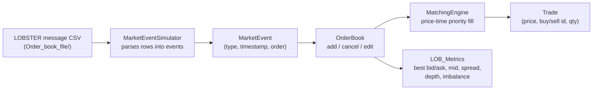

# LOB Market Microstructure Simulator

A C++ limit order book (LOB) simulator that models the core mechanics of an exchange matching engine: order submission, price-time-priority matching, cancellations, trade generation, and real-time market microstructure metrics. It ships with a real historical **LOBSTER-format** Level-1 message file for AAPL, allowing the simulator to be driven with authentic exchange order flow.

---

## Table of Contents

- [Overview](#overview)
- [Key Features](#key-features)
- [Architecture](#architecture)
- [Data](#data)
- [Getting Started](#getting-started)
- [Example Usage](#example-usage)
- [Replaying Historical Data](#replaying-historical-data)
- [Roadmap / Future Development Ideas](#roadmap--future-development-ideas)
- [Contributing](#contributing)
- [License](#license)
- [Author](#author)

---

## Overview

This project implements the building blocks of a limit order book from the ground up in modern C++:

- A **price-time-priority order book** that maintains separate bid and ask sides.
- A **matching engine** that fills incoming limit and market orders against resting liquidity.
- A **market event model** (new order / modify order / cancel order) that mirrors how real exchanges communicate order flow.
- A **metrics module** for computing standard market microstructure statistics (best bid/ask, mid-price, spread, depth, order book imbalance).
- A **market event replay tool** that parses LOBSTER-format historical message files so the simulator can be driven with real trading-day data.

It's designed as a research and learning tool for exploring how order books evolve tick-by-tick, and as a foundation for building market microstructure analysis, execution simulation, or agent-based trading research on top of.

## Key Features

- **Price-time priority matching** — bid side ordered highest-price-first, ask side ordered lowest-price-first, with FIFO queues at each price level.
- **Limit and market order support**, including partial fills that walk multiple queued orders at a price level.
- **Order lifecycle management** — add, cancel, and look up orders by ID across the book.
- **Trade recording** for completed matches (price, buyer ID, seller ID, quantity).
- **Market microstructure metrics**: best bid, best ask, mid-price, spread, per-side volume, total depth, and order book imbalance.
- **Historical data replay** via a LOBSTER message-file parser, so the book can be reconstructed from real recorded order flow rather than synthetic data.
- **Included real-world dataset**: a full-session AAPL Level-1 message file (21 June 2012, 09:30–16:00 ET, ~118,000 events).

## Architecture



| Component | Files | Responsibility |
|---|---|---|
| **Order** | `include/Order.h`, `src/Order.cpp` | Core order representation — ID, price, quantity, side (`BUY`/`SELL`), and type (`LIMIT`/`MARKET`). |
| **MarketEvents** | `include/MarketEvents.h` | Represents an exchange event (`NEW_ORDER`, `MODIFY_ORDER`, `CANCEL_ORDER`) with a timestamp and its associated order. |
| **OrderBook** | `include/OrderBook.h`, `src/OrderBook.cpp` | Maintains the bid/ask price levels as ordered maps of FIFO order queues; handles adding, cancelling, and editing orders, and dispatches incoming market events. |
| **MatchingEngine** | `include/MatchingEngine.h`, `src/MatchingEngine.cpp` | Executes price-time priority matching against the opposite side of the book — walking price levels and fully or partially filling incoming orders. |
| **Trade** | `include/Trade.h`, `src/Trade.cpp` | Represents and stores completed trades. |
| **LOB_Metrics** | `src/LOB_Metrics.cpp` | Computes market microstructure statistics from the live order book: best bid/ask, mid-price, spread, bid/ask volume, total depth, and order book imbalance. |
| **MarketEventSimulator** | `src/MarketEventSimulator.cpp` | Parses LOBSTER-format CSV message files into a stream of `MarketEvent` objects to replay historical order flow. |

## Data

`Order_book_file/AAPL_2012-06-21_34200000_57600000_message_1.csv` is a **LOBSTER-format Level-1 message file** — a widely used academic format for reconstructed limit order book data derived from NASDAQ TotalView-ITCH feeds.

Each row encodes one order book event with six comma-separated fields:

| Column | Meaning |
|---|---|
| Time | Seconds after midnight, with nanosecond precision |
| Event Type | `1` new limit order, `2` partial cancellation, `3` total deletion, `4` visible execution, `5` hidden execution, `7` trading halt |
| Order ID | Unique exchange-assigned order identifier |
| Size | Order size in shares |
| Price | Price in dollars × 10,000 (the simulator divides by 10,000 to recover the dollar price) |
| Direction | `1` = buy order, `-1` = sell order |

The filename itself encodes the ticker, trading date, and the session window in milliseconds since midnight — `34200000` ms = 09:30:00 and `57600000` ms = 16:00:00, the standard NASDAQ continuous trading session.

## Getting Started

### Prerequisites

- A C++17-capable compiler (`g++` or `clang++`)
- No external dependencies — standard library only

### Compiling

The project is organized as a set of reusable modules (headers in `include/`, implementations in `src/`). To build the simulator into an executable, compile the sources together with a driver program that wires the components together:

```bash
g++ -std=c++17 -Iinclude src/*.cpp your_driver.cpp -o lob_simulator
./lob_simulator
```

A minimal `CMakeLists.txt` is a natural addition here — see [Roadmap](#roadmap--future-development-ideas).

## Example Usage

A typical driver program constructs an order book, feeds it orders or replayed market events, and queries live metrics:

```cpp
#include "OrderBook.h"
#include "MarketEvents.h"

int main() {
    OrderBook book;

    Order buyOrder{1, 100.50, 50, Side::BUY, OrderType::LIMIT};
    book.addOrder(buyOrder);

    Order sellOrder{2, 100.75, 30, Side::SELL, OrderType::LIMIT};
    book.addOrder(sellOrder);

    // A crossing order triggers the matching engine and produces a trade
    Order marketBuy{3, 0.0, 20, Side::BUY, OrderType::MARKET};
    book.addOrder(marketBuy);

    return 0;
}
```

## Replaying Historical Data

`MarketEventSimulator` reads a LOBSTER message file line by line, parses each row into an `Order` and wraps it in a `MarketEvent`, ready to be dispatched into the `OrderBook`. Point it at any LOBSTER-format CSV — the bundled AAPL sample lives in `Order_book_file/` — to reconstruct a full trading session's worth of order flow and drive the simulator with real market dynamics rather than synthetic orders.

## Roadmap / Future Development Ideas

- Add a CMake-based build system and a bundled CLI entry point so the simulator compiles and runs end-to-end out of the box.
- Add a unit test suite (Catch2 or GoogleTest) covering matching engine edge cases — partial fills, multiple price levels, and order cancellation.
- Support order modification (price/quantity amendment), not just add and cancel.
- Add order book depth snapshots (top-N levels) that can be exported for downstream analysis or visualization.
- Build a visualization layer (e.g., a Python or C++ plotting tool) charting reconstructed book state and LOB metrics — mid-price, spread, and imbalance — over the trading session.
- Extend the market event simulator to support full LOBSTER depth files (multi-level order book snapshots), not just the Level-1 message file.
- Add a simulated real-time replay mode that paces event dispatch by timestamp, rather than batch-parsing the entire file at once.
- Persist reconstructed order book state and trade history to CSV/Parquet for later quantitative analysis.
- Add configurable tick size and lot-size validation rules.
- Add multi-symbol support, since the simulator currently models a single instrument at a time.
- Benchmark and optimize matching engine throughput on large LOBSTER files.
- Add Python bindings (e.g., via `pybind11`) so the C++ engine can be driven from Python/Jupyter for research workflows.

## Contributing

Contributions are welcome:

1. Fork the repository.
2. Create a feature branch (`git checkout -b feature/your-feature`).
3. Commit your changes with clear messages.
4. Push and open a pull request describing what changed and why.

## License

No license file is currently present in this repository. Until one is added, all rights are reserved by default by the author. If you intend to share this project publicly, consider adding an [MIT License](https://choosealicense.com/licenses/mit/), which is common for academic and portfolio projects.

## Author

**aabhasp6UCL** — [github.com/aabhasp6UCL](https://github.com/aabhasp6UCL)
